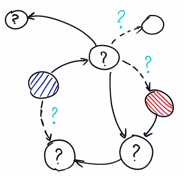

# Our objective  

The project will propose methods and algorithms capable of handling the compound nature of modern-era social media networks, as well as their dynamism and complex data structures. These solutions will be used in the learning and inference tasks, as well as the machine learning methods for data spread analysis. Additionally, the aim of the project is to achieve a better understanding of the task of link prediction.

# Planned research  
The project will propose methods and algorithms capable of handling the nature of modern-era social media networks like Facebook or Twitter. Observing how people use these social media platforms the propose
methods will try to predict their future behavior. 

As social media turn more from the role of connecting people to delivering news, funny pictures and spreading posts that exhibit users’ opinions, it is a rising question of how does this happen in the big picture? Is there a nature of spreading processes that allow prediction of a story’s success? We aim to create real-world data-driven models and explore the data to understand these processes and answer such questions.

As more data is gathered, we learn more and more how dynamic social media networks are. Thus arises the need for new models of learning and classifying users, objects and phenomena not only how connected they are in the given moment, but from how the dynamics of their relations changed over time. Much more can be inferred from how the ratings a user gives to movies change over time than from the fact that at a given point, the user liked this or that. 

Our progress in modeling dynamics of networks will allow us to make more accurate predictions about the following phenomena, that - while currently researched - can be improved with new methods of machine learning on dynamic networks:
- how does the information spread on the real-world dynamic networks?
- how far and how fast does the information flow trough the dynamic network?
- how do the network structure and characteristics of particular nodes affect the information flow?
- predicting links between users and objects
- what is the underlying structure of the network based on the spreading behavior?
- who are the most influential users, communities, relations?
- how does the structure of network affect the flow of information in general?
- is there any hidden link between users absent in the network?
- how does individual or collective behavior affect spread?

  

# Project's timeline
The research project started in February 2017 and will finish in February 2021.

  
  

